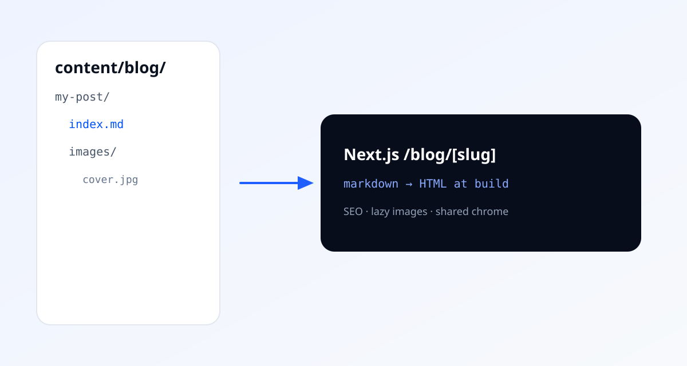

Writing should feel like dropping a folder into the repo — not wiring a CMS.

Each post on this site lives under `content/blog/<slug>/` with a fixed shape:

```text
content/blog/shipping-in-public/
  index.md
  images/
    architecture.svg
```

## Authoring

Frontmatter at the top of `index.md` drives the listing card, canonical URL, Open Graph tags, and JSON-LD:

- **title** / **description** — required; used for SEO and the blog index
- **date** — ISO date (`YYYY-MM-DD`)
- **tags** — optional list
- **image** — optional cover path relative to the post folder
- **draft** — set `true` to hide the post in production builds

Body content is ordinary Markdown (GitHub-flavored): headings, lists, links, code, tables, and images.

## Images

Reference colocated assets with a path under `images/`:



Those files are served from `/blog/<slug>/images/...`, get long-cache headers, and ship with `loading="lazy"` plus `decoding="async"` so below-the-fold media does not block first paint.

## Why not `slug.html` files?

Next.js already statically generates HTML for `/blog` and `/blog/[slug]` at build time. Keeping Markdown as the source of truth means:

1. Shared navbar, footer, fonts, and brand colors stay consistent
2. `generateMetadata` + Article JSON-LD cover SEO without hand-maintaining `<head>` tags
3. Drafts, reading time, and adjacent-post links stay in one TypeScript module

The mental model is still “folder in, page out” — the output just rides the App Router instead of a separate `.html` artifact.
